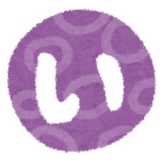
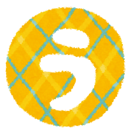

# Kotoba: A Digital Computing System and Language

<div align="center">
  
  
  
  
  
</div>

**Kotoba is a next-generation digital computing system where every aspect of computation—from low-level hardware operations to high-level application logic—is represented, optimized, and executed as a graph.**

This project unifies two powerful concepts:
1.  **The Tamaki VM**: A high-performance, modern Von Neumann-style virtual machine featuring a **Graph Neural Network (GNN)-based optimization engine**.
2.  **The Kotoba Language**: A declarative, functional language based on Jsonnet for defining applications, schemas, and business logic as verifiable, content-addressed graphs.

Together, they form a cohesive ecosystem that treats computing as a continuous process of **graph rewriting**.

```bash
🧠 GNN-Powered VM for Hardware Optimization
🔄 Unified Graph Rewriting from Low-Level to High-Level
📜 Declarative, Content-Addressed Application Definitions
🏗️ Purely Functional Core with Effects Shell Boundary
```

[](https://www.rust-lang.org/)
[](https://github.com/com-junkawasaki/kotoba/actions)
[](https://opensource.org/licenses/Apache-2.0)
[](#-architecture-pure-kernel--effects-shell)

## 📖 Vision: Computation as Graph Rewriting

Kotoba reimagines the entire computing stack through the lens of graph theory. Instead of separate, disjointed layers of abstraction (hardware, OS, application), Kotoba proposes a unified model:

-   **Low-Level Execution as a Graph**: The **Tamaki VM** represents low-level program instructions and data dependencies as a **Program Interaction Hypergraph (PIH)**. This graph is not just a representation; it is the program itself, ready to be optimized and executed.
-   **High-Level Logic as a Graph**: The **Kotoba Language** uses declarative `.kotoba` files (Jsonnet) to define application logic, data schemas, and UI components as a graph of interconnected objects and functions.
-   **Optimization as Graph Rewriting**: The GNN engine within the VM learns the most effective sequences of graph transformations (DPO rules) to optimize the PIH for specific hardware targets (CPU, GPU, CGRA/FPGA).
-   **Verifiability through Content-Addressing**: Every object in the system, from a low-level operation to a high-level UI component, is assigned a **Content ID (CID)** based on its contents. This creates an immutable, verifiable Merkle-DAG of the entire system state, ensuring reproducibility and enabling powerful caching.

This unified approach allows high-level application definitions to be compiled down into an optimizable graph representation that the VM can tailor for maximum performance on heterogeneous hardware.

## 🏗️ Architecture: Pure Kernel & Effects Shell

The entire system is built upon a **Purely Functional Architecture**, separating deterministic logic from side effects.

```
┌─────────────────────────────────────────────────────────────┐
│                       Effects Shell                         │
│ (Handles all I/O, state changes, and non-deterministic ops) │
│ ┌───────────────┐   ┌───────────────┐   ┌───────────────┐   │
│ │  HTTP Server  │   │  Database IO  │   │   File System │   │
│ └───────┬───────┘   └───────┬───────┘   └───────┬───────┘   │
└─────────┼───────────────────┼───────────────────┼─────────┘
          │ (Requests as Data)│ (Data as Patches) │
          ▼                   │                   ▼
┌─────────────────────────────────────────────────────────────┐
│                         Pure Kernel                         │
│      (Deterministic, stateless, purely functional core)     │
│                                                             │
│ ┌─────────────────────────────────────────────────────────┐ │
│ │  Kotoba Language Engine (Jsonnet to Graph Transformation) │ │
│ └─────────────────────────────────────────────────────────┘ │
│ ┌─────────────────────────────────────────────────────────┐ │
│ │       GNN Optimization Engine (PIH Graph Rewriting)     │ │
│ └─────────────────────────────────────────────────────────┘ │
│ ┌─────────────────────────────────────────────────────────┐ │
│ │         Tamaki VM (Low-Level Graph Execution)           │ │
│ └─────────────────────────────────────────────────────────┘ │
│                                                             │
└─────────────────────────────────────────────────────────────┘
```

## 📁 Unified Project Structure

The project is a modular multi-crate workspace, separating the low-level computing system from the high-level application framework.

```
├── crates/
│   ├── 001-core/                 # Core types, functional primitives
│   ├── 002-language/             # Kotoba Language (Jsonnet) and compiler
│   ├── 003-graph/                # High-level graph data structures and GQL engine
│   ├── 004-storage/              # Pluggable storage adapters (RocksDB, Redis)
│   └── 005-vm/                   # The Tamaki Digital Computing System VM
│       ├── vm-types/             # Core types for the VM
│       ├── vm-memory/            # VM memory management
│       ├── vm-cpu/               # Von Neumann CPU core
│       ├── vm-scheduler/         # DAG scheduling and execution runtime
│       ├── vm-hardware/          # Heterogeneous hardware tile abstractions
│       ├── vm-gnn/               # GNN Optimization Engine (PIH, DPO, CID)
│       └── vm-core/              # VM integration and orchestration
├── kotoba-cli/                   # Main CLI for the Kotoba ecosystem
└── kotoba-server/                # Effects Shell implementation for the HTTP server
```

## 🎯 Key Components

### 1. The Tamaki Digital Computing System (`005-vm`)

A high-performance virtual machine that forms the execution layer of Kotoba.

-   **GNN Optimization Engine**: Uses a Program Interaction Hypergraph (PIH) to apply learned, hardware-specific optimizations via safe DPO graph rewriting.
-   **Content-Addressable**: Employs a CID (Content ID) system with Blake3 hashing to create a verifiable Merkle-DAG of all computations.
-   **Heterogeneous Execution**: Simulates and schedules tasks across diverse hardware tiles like CPUs, GPUs, and specialized accelerators (CGRA/FPGA).
-   **High Performance**: Backed by extensive benchmarks demonstrating significant speedups over traditional approaches.

**🚀 Validated Performance of the Tamaki VM:**
- **DAG Scheduling**: **5.7x** faster than simple topological sort.
- **Memory Efficiency**: **35x** better sequential access performance.
- **Memoization**: **78-85%** cache hit rates.
- **Network Efficiency**: **288x** improvement over pure ring topology at 65k nodes.
- **Energy Savings**: **35-45%** reduction compared to traditional systems.
- **Case Studies**: **2.3x-4.7x** performance improvements across ETL, ML, video analytics, and scientific simulation.

### 2. The Kotoba Language & Framework

The high-level, declarative layer for building applications on the Kotoba system.

-   **Declarative `.kotoba` Files**: Uses Jsonnet to define applications, data schemas, API routes, and UI components in a structured, verifiable way.
-   **ISO GQL Compliant**: A powerful graph query engine for interacting with application data.
-   **Hexagonal Architecture**: Pluggable adapters for storage (RocksDB, Redis, In-Memory) and other external services, keeping the core logic pure.
-   **Purely Functional Core**: All business logic is deterministic, transforming immutable graph data structures without side effects.

## 🚀 Quick Start

### Prerequisites

-   **Rust 1.70.0 or later**
-   **Cargo package manager**

### Installation & Usage

```bash
# Clone the repository
git clone https://github.com/com-junkawasaki/kotoba.git
cd kotoba

# Build the entire project workspace
cargo build --release --workspace

# Run the comprehensive test suite for all crates
cargo test --workspace

# Run the main CLI
./target/release/kotoba-cli --help

# Run the VM-specific benchmarks
cargo bench --package vm-benchmarks
```

## 🤝 Contributing

This project aims to redefine computing from the ground up. Contributions are welcome, from low-level VM optimizations to high-level language features.

1.  **Fork the repository**
2.  **Create a feature branch** (`git checkout -b feature/your-feature`)
3.  **Commit your changes** (`git commit -m 'feat: Add some feature'`)
4.  **Push to the branch** (`git push origin feature/your-feature`)
5.  **Open a Pull Request**

## 📄 License

This project is licensed under the Apache License 2.0. See the [LICENSE](LICENSE) file for details.
