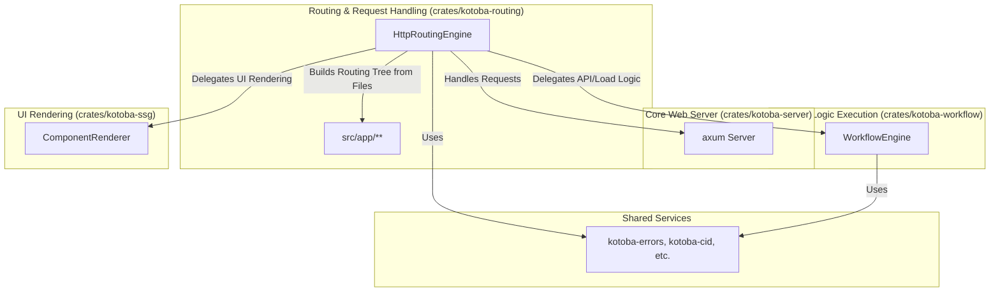

# Kotobaフルスタックフレームワーク設計ドキュメント

## 1. はじめに: Kotobaフルスタックフレームワークとは

Kotobaは、データ層からプレゼンテーション層までを単一のRustエコシステムで統一することを目指す、自己完結型のフルスタックWebフレームワークです。

プロジェクト全体の構造は`dag.jsonnet`に定義された**プロセスネットワークグラフモデル**に基づいており、すべてのコンポーネントは明確な依存関係を持つノードとして表現されます。これにより、論理的なビルド順序（トポロジカルソート）と、効率的な問題解決順序（逆トポロジカルソート）が保証されます。

本フレームワークは、以下の哲学に基づいています。

-   **パフォーマンス**: すべてのコアコンポーネントをRustで実装し、ネイティブパフォーマンスを最大化します。
-   **統一された型安全性**: Rustの強力な型システムを、データベースからUIレンダリングまで一貫して利用します。
-   **宣言的な開発**: APIのロジックやUIの構造を、コードではなく設定ファイル（`.kotoba` / Jsonnet）で宣言的に記述します。
-   **責務の分離**: 各クレートが専門的な役割（ルーティング、ワークフロー実行、UIレンダリング）に集中し、疎結合なアーキテクチャを維持します。

## 2. アーキテクチャ概観

本フレームワークは、複数の専門クレートが協調して動作することで実現されます。



### 主要コンポーネントの責務

-   **`kotoba-server` (axum)**
    -   Webサーバーの起動とリクエスト/レスポンスのライフサイクル管理を担当するエントリーポイント。
    -   すべてのリクエストを`kotoba-routing`エンジンに委譲します。

-   **`kotoba-routing`**
    -   フレームワークの**頭脳**。
    -   起動時に`src/app`ディレクトリをスキャンし、ファイル規約（`route.rs`, `page.kotoba`等）に基づいてルーティングツリーを構築します。
    -   リクエストを解釈し、APIワークフローを実行するか、UIページをレンダリングするかを判断します。
    -   CIDベースのキャッシュ機構により、ルーティング解決を高速化します。

-   **`kotoba-workflow`**
    -   APIとデータローディングの**実行エンジン**。
    -   `.kotoba`ファイルに定義されたワークフロー（DBクエリ、グラフ書き換えなど）のステップを解釈し、実行します。

-   **`kotoba-ssg`**
    -   **UIレンダリングエンジン**。
    -   `page.kotoba`と`layout.kotoba`に定義されたコンポーネントツリーと、`load`ワークフローから渡された`props`を組み合わせて、最終的なHTMLを生成します。

-   **`kotoba-errors`**
    -   統一されたエラー処理を提供します。フレームワークのどの層でエラーが発生しても、`KotobaError`に集約され、最終的に適切なHTTPレスポンスに変換されます。

## 3. 開発ワークフロー

Kotobaフレームワークでの開発は、`src/app`ディレクトリ内に規約に基づいたファイルを作成することから始まります。

### ディレクトリ構造

-   `src/app/`
    -   `layout.kotoba`: アプリケーション全体のルートレイアウト。
    -   `page.kotoba`: トップページ（`/`）のUI。
    -   `api/`
        -   `v1/`
            -   `status/`
                -   `route.rs`: `/api/v1/status`のエンドポイントを処理するAPIルート。
    -   `users/`
        -   `[id]/` (動的セグメント)
            -   `layout.kotoba`: `/users/:id`とその配下のパスに適用されるレイアウト。
            -   `page.kotoba`: `/users/:id`のユーザー詳細ページのUI。

### APIルートの作成 (`route.rs`)

APIエンドポイントは`.rs`ファイル（または`.kotoba`ファイル）で定義します。ファイルは`ApiRoute`構造体に対応するJsonnetを返す必要があります。

**`src/app/api/v1/status/route.kotoba`**
```jsonnet
// このファイルは `/api/v1/status` にマッピングされる
{
  handlers: {
    // GETメソッドのハンドラを定義
    GET: {
      steps: [
        {
          id: 'get_status',
          type: 'custom', // 実際にはDBクエリなどが入る
          params: { message: 'ok' },
        },
        {
          id: 'return_status',
          type: 'return',
          statusCode: 200,
          // 前のステップの結果を参照
          body: "context.get_status.result", 
        },
      ],
    },
  },
}
```

### UIページの作成 (`page.kotoba` / `layout.kotoba`)

UIは`.kotoba`ファイルで、コンポーネントツリーとして宣言的に定義します。

**`src/app/users/[id]/page.kotoba`**
```jsonnet
{
  // サーバーサイドで実行されるデータローディング
  load: {
    steps: [
      {
        id: 'fetch_user',
        type: 'db_query',
        // リクエストのパスパラメータを参照
        query: "MATCH (u:User) WHERE u.id == $params.id RETURN u",
      },
      {
        id: 'return_user',
        type: 'return',
        body: "{ user: context.fetch_user.result[0] }",
      },
    ],
  },

  // UIコンポーネントの定義
  component: {
    type: 'div',
    children: [
      { type: 'h1', children: ["'User Profile'"] },
      // `load`の結果 (`props`) を使って動的にコンテンツを生成
      { type: 'p', children: ["'Name: ' + props.user.name"] },
    ],
  },
}
```

## 4. 主要な機能

-   **ファイルベースルーティング**: `src/app`内のディレクトリ構造が自動的にURLにマッピングされます。`[param]`形式の動的セグメントもサポートします。

-   **宣言的ワークフロー**: APIやデータローディングのロジックを、`db_query`や`return`といったステップの連なりとしてJsonnetで記述します。これにより、ビジネスロジックと実行エンジンが明確に分離されます。

-   **サーバーサイドUIレンダリング**: `page.kotoba`と`layout.kotoba`ファイルはサーバーサイドでHTMLにレンダリングされます。`load`ワークフローの結果が`props`としてコンポーネントに渡され、動的なページ生成が可能です。

-   **CIDベースのキャッシュ**: 一度解決されたリクエストパスは、その内容から計算されたCIDをキーとしてキャッシュされます。同じリクエストに対しては、ルーティングツリーの探索をスキップし、高速に応答します。

-   **統一されたエラーハンドリング**: `kotoba-errors`クレートが提供する`KotobaError`により、アプリケーション全体で一貫したエラー処理を実現します。DBエラーやNot Foundエラーは、自動的に適切なHTTPステータスコードに変換されます。
